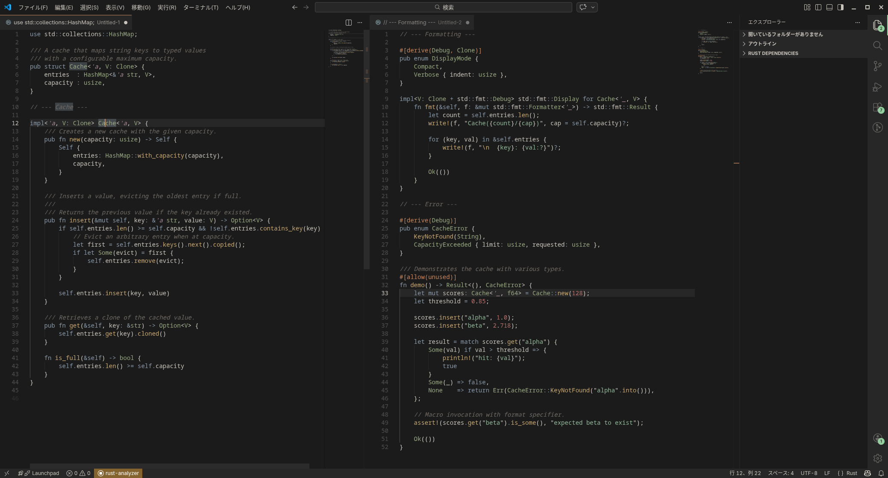
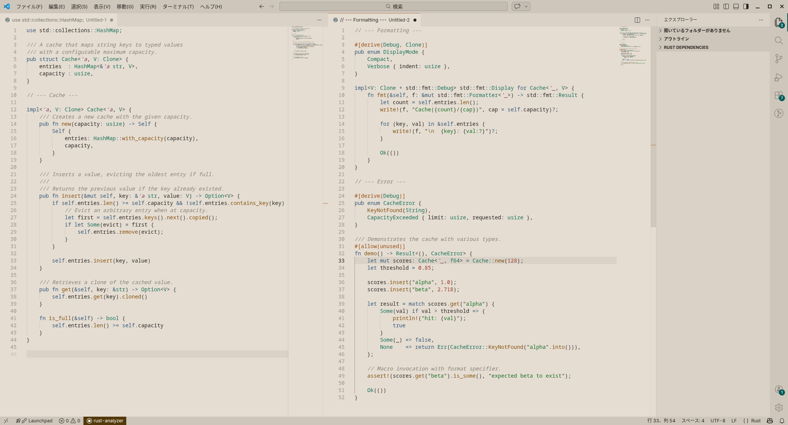

# Copper Elegance

Warm dark and light themes for VS Code with copper and verdigris accents.

## Variants

### Copper Elegance (Dark)



### Copper Luminance (Light)



## Install

From a `.vsix` file:

```
code --install-extension techgeek1.copper-elegance-0.1.0.vsix
```

Or in VS Code: Extensions sidebar > `...` menu > "Install from VSIX..."

## Build

Requires Python 3:

```
python3 build.py
```

## License

MIT
